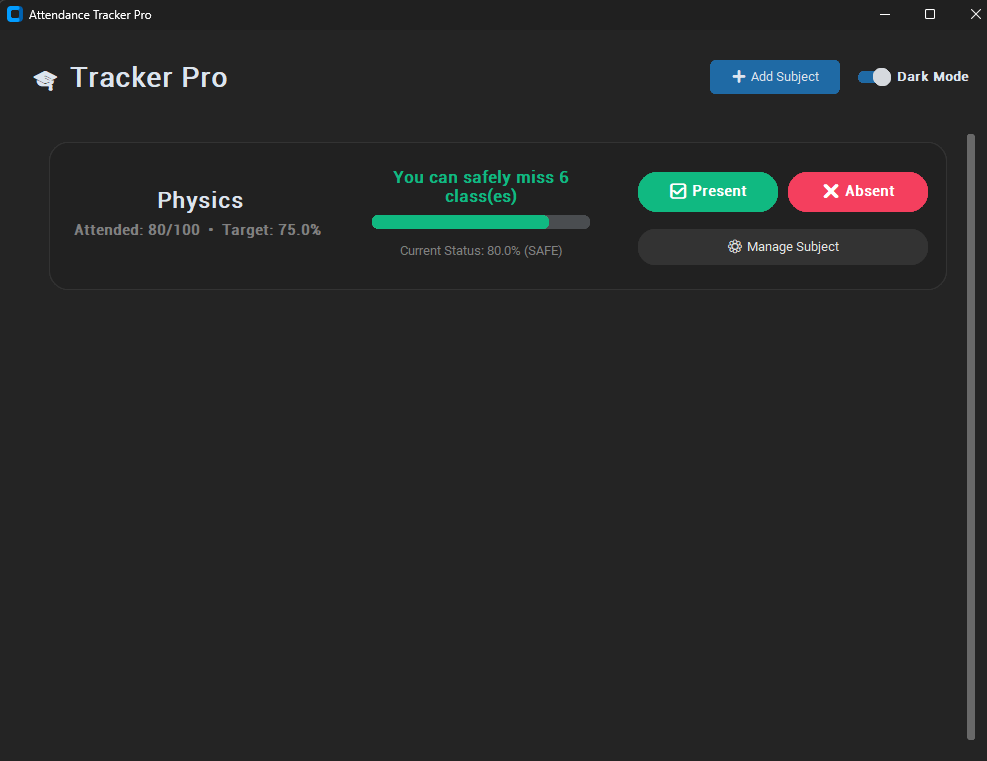

# 🎓 Attendance Tracker Pro

A modern, high-performance desktop application built with Python and CustomTkinter. This tool helps students manage university attendance, track history, and calculate exactly how many classes they need to attend to meet their target percentage.

## 🚀 Key Features
* **Smart Attendance Logic**: Real-time calculation of "Safe" or "Short" status.
* **Predictive Analysis**: Tells you exactly how many lectures you can safely miss or must attend to reach your goal (e.g., 75%).
* **Modern UI/UX**: Built with a sleek, responsive dark-mode interface using `CustomTkinter`.
* **Persistent History**: Automatically logs every attendance mark with a timestamp in a local JSON database.
* **History Management**: Ability to toggle attendance status or delete specific logs.

## 🛠️ Tech Stack
* **Language**: Python 3.x
* **GUI**: CustomTkinter / Tkinter (ttk)
* **Data**: JSON (Local Persistence)
* **Logic**: Math-based prediction algorithms

## 📦 Installation & Usage
1. **Clone the repository:**
   ```bash
   git clone https://github.com/i-am-ks901/attendance-tracker-pro.git

2. **Install dependencies:**
   ```bash
   pip install customkinter

3. **Run the application:**
   ```bash
   python AttendanceTracker.py

## 📸 Preview

